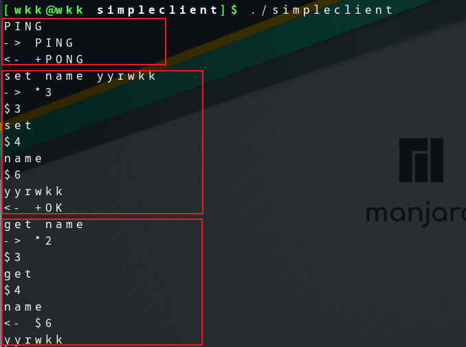

# HiRedisRoam

HiRedis 学习

https://github.com/redis/hiredis

## 文档翻译

HiRedis是Redis(https://redis.io/)数据库的简约C客户端库。

为协议添加了最基本的支持。

除了支持发送命令和接收回复外，它还配备了与I/O层解耦的回复解析器。

它是一个流解析器，可以方便的重用，实现高效的回复解析。

## simpleclient

HiRedisRoam/ref/simpleclient 是一个简单的Redis客户端-服务器通信协议的测试工具。

支持: PING、set、get命令。

```c
PING
set name yyrwkk
get name 
```



